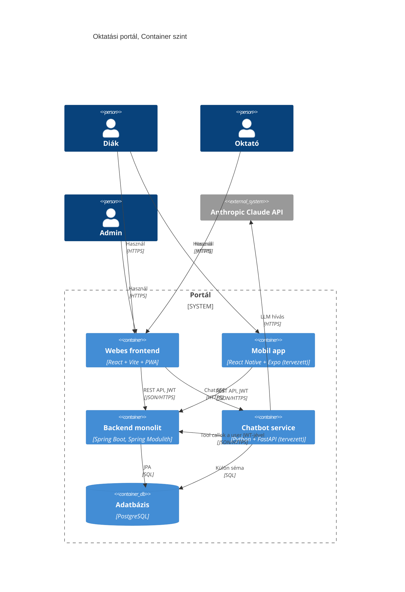

# C4 Container ábra

Ez az ábra a rendszer fő komponenseit és köztük lévő kommunikációt mutatja. A kliens oldalon webes és mobil frontend, a szerver oldalon a Java monolit, a Python chatbot service és a közös Postgres adatbázis.

## Magyarázat

A webes és a mobil kliens egyaránt a monolitot szólítja a portál üzleti adataihoz (jegyek, órarend, üzenetek). A chatbot felé külön SSE csatorna megy, a chatbot pedig tool use-szal úgy hív vissza a monolitra, hogy a felhasználó JWT-jét továbbküldi, így az `@PreAuthorize` szabályok automatikusan érvényesülnek.

Az adatbázis közös Postgres instance. A chatbot egy külön sémában tárolja a beszélgetéseket, ezzel az isolation egyszerű és deploymentkor nincs külön DB konténer.

A "tervezett" jelzésű komponensek (mobil app, chatbot service) a verseny során épülnek meg, lásd [TASKS/](../../TASKS/) mappa briefjeit.
